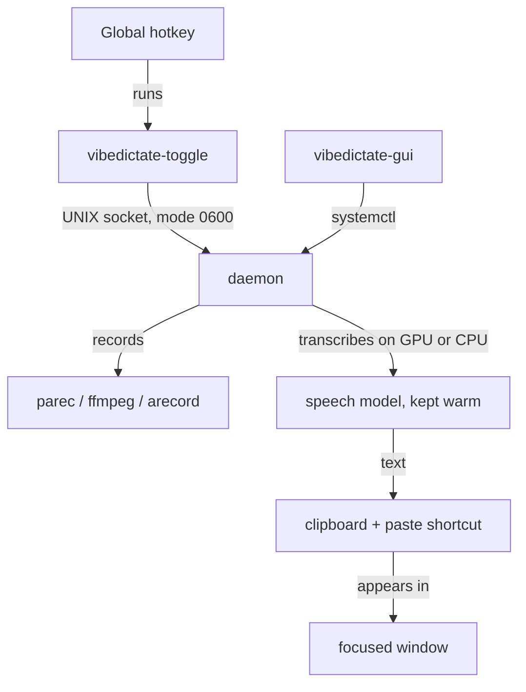

# 🎙️ VibeDictate

> **Fast, fully local voice dictation for Linux.**
> Press a hotkey, speak, and your words appear in whatever window has focus.
> Nothing is uploaded, nothing is logged.

> 🌐 **Language:** [English](README.md) · [Español](README_ES.md)

> ⚠️ **Linux only.** Requires a systemd user session and PipeWire or PulseAudio.
> Tested on Arch/CachyOS, Debian/Ubuntu and Fedora, on Wayland and X11.
> Not compatible with Windows or macOS.

---

## What it does

A small daemon keeps a speech-recognition model resident in GPU VRAM (or system
RAM). When you press your hotkey it records the microphone; when you press it
again it transcribes on-device and injects the text into the focused window.

Because the model never unloads, there is no start-up cost per dictation — only
the transcription itself.

### Features

* **Fully offline.** Audio is captured into `tmpfs`, transcribed locally, and
  the buffer is deleted immediately. No network calls after the initial model
  download.
* **Nothing left behind.** Transcripts are never written to the system journal,
  and the clipboard is restored to its previous contents after pasting.
* **Automatic hardware fallback.** Uses NVIDIA CUDA when it works, and silently
  drops to CPU inference when it does not — including when the GPU is present
  but its libraries are broken.
* **Wayland and X11.** Clipboard-based injection preserves accents, uppercase
  and emoji exactly. Supports `wtype`, `ydotool` and `xdotool`.
* **Custom vocabulary.** Prime the recogniser with jargon, product names or
  acronyms so it stops mangling the words you actually use.
* **No clipped endings.** The audio ring buffer is drained before stopping, so
  the last syllable always makes it in.

### Measured performance

10 seconds of speech, best of three runs, on a laptop with an RTX 5050 (8 GB)
and an 8-core Zen 5 CPU:

| Model | Backend | Time to transcribe 10 s | Ratio |
|---|---|---|---|
| `large-v3-turbo` (default) | CUDA · float16 | 0.70 s | 14× real time |
| `large-v3-turbo` | CPU · int8 | 8.8 s | 1.1× real time |
| `tiny` | CPU · int8 | 0.51 s | 20× real time |

A typical five-second phrase therefore lands in roughly a third of a second on
a GPU. Model load happens once at service start (1–5 s), not per dictation.

The large model is only comfortable on a GPU, which is why `install.sh`
preconfigures a smaller one on machines without an NVIDIA card.

---

## Architecture



---

## Installation

```bash
git clone https://github.com/KaliGASJ/VibeDictate.git
cd VibeDictate
./install.sh
```

The installer:

1. Checks which system packages are missing and **shows you the exact command**
   before running anything with `sudo`. Nothing is installed behind your back.
2. Creates a virtualenv in `~/.local/share/VibeDictate/.venv`.
3. Installs the CUDA 12 / cuDNN 9 wheels **only if an NVIDIA GPU is present**,
   so no system-wide CUDA toolkit is needed. On other machines it preconfigures
   CPU inference.
4. Installs a systemd user service and a desktop entry.
5. Runs a self-check and reports anything still missing.

Useful flags: `--yes`, `--prefix DIR`, `--skip-system-deps`, `--skip-cuda`.

Then start it:

```bash
systemctl --user start vibedictate.service
```

The model downloads on first start (roughly 1.5 GB for the default) into
`~/.local/share/VibeDictate/models/`.

### Requirements

Python 3.9 or newer, plus:

| Purpose | Wayland | X11 |
|---|---|---|
| Recording | `parec` (pipewire-pulse / pulseaudio-utils), or `ffmpeg`, or `arecord` | same |
| Clipboard | `wl-clipboard` | `xclip` or `xsel` |
| Keystrokes | `wtype`, or `ydotool` on GNOME | `xdotool` |
| Notifications | `libnotify` (optional) | same |
| Control panel | PyGObject + GTK4 or GTK3 (optional) | same |

`install.sh` maps these to the right package names for pacman, apt, dnf and
zypper.

---

## Setting up the hotkey

Bind the `vibedictate-toggle` command to any key combination. `Ctrl+Space` is a
good default.

* **KDE Plasma** — Settings → Shortcuts → Add → Command: `vibedictate-toggle`
* **GNOME / COSMIC** — Settings → Keyboard → Custom Shortcuts → Command:
  `vibedictate-toggle`
* **Hyprland** — `bind = CTRL, SPACE, exec, vibedictate-toggle`
* **Sway** — `bindsym Ctrl+space exec vibedictate-toggle`

If `~/.local/bin` is not on your `PATH`, use the full path
`~/.local/share/VibeDictate/vibedictate-toggle` instead.

---

## GNOME on Wayland

GNOME's compositor does not implement the virtual keyboard protocol, so `wtype`
cannot deliver the paste shortcut there. Install `ydotool`, which goes through
the kernel's `uinput` device instead:

```bash
sudo pacman -S ydotool          # Arch / CachyOS
sudo apt install ydotool        # Debian / Ubuntu
sudo dnf install ydotool        # Fedora

sudo systemctl enable --now ydotoold
```

VibeDictate detects GNOME and prefers `ydotool` automatically. If neither tool
works, the text is still placed on your clipboard and a notification tells you
to paste it yourself — dictation never silently fails.

---

## Configuration

All settings live in `~/.local/share/VibeDictate/env.sh`, a plain shell file.
Apply changes with `systemctl --user restart vibedictate.service`.

| Variable | Default | What it does |
|---|---|---|
| `VD_MODEL` | `deepdml/faster-whisper-large-v3-turbo-ct2` | Model to load. Use `small` or `base` on CPU-only machines. |
| `VD_DEVICE` | `auto` | `auto`, `cuda` or `cpu`. |
| `VD_COMPUTE` | `float16` | `float16`, `int8` or `float32`. |
| `VD_LANG` | `en` | Two-letter code, or empty to auto-detect. |
| `VD_PROMPT` | empty | Priming vocabulary, ~220 tokens max. |
| `VD_PASTE_METHOD` | `auto` | `auto`, `clipboard` or `type`. |
| `VD_PASTE_KEY` | `ctrl+shift+v` | Switch to `ctrl+v` if you dictate into office suites. |
| `VD_CLIPBOARD_RESTORE` | `1` | Put your previous clipboard back after pasting. |
| `VD_LOG_TRANSCRIPT` | `0` | Write transcripts to the journal. Debugging only. |
| `VD_AUDIO_DEVICE` | empty | Input source name; see `pactl list short sources`. |
| `VD_NOTIFICATIONS` | `1` | Desktop notification bubbles. |

`env.sh.example` documents every option, including the less common ones.

### Custom vocabulary

`VD_PROMPT` biases recognition towards words it would otherwise get wrong —
technical terms, brand names, colleagues' names:

```bash
export VD_PROMPT="Kubernetes, Terraform, PostgreSQL, idempotent, Prometheus, Grafana"
```

---

## Privacy

The point of running locally is that nothing escapes the machine, so the
defaults are chosen accordingly:

* **Audio** is written to `$XDG_RUNTIME_DIR`, which is `tmpfs` — it lives in RAM,
  never touches the disk, and the file is unlinked as soon as it is transcribed.
* **Transcripts are not logged.** The journal is persistent and readable by
  administrators, so only lengths and timings go there. Set
  `VD_LOG_TRANSCRIPT=1` while debugging, then turn it back off.
* **The clipboard is restored** to its previous contents after pasting, so
  clipboard managers do not persist your dictation to disk. The restore is
  skipped if you copied something else in the meantime.
* **The control socket is mode 0600**, created atomically under a umask so it is
  never briefly reachable by other users on the machine.
* **The network is only used once**, to download the model.

---

## Control panel

```bash
vibedictate-gui
```

Shows live state (stopped / starting / ready / recording) and lets you stop the
daemon to release VRAM when you need it for something else. Also available from
your application menu as *VibeDictate*.

---

## Troubleshooting

Start here — it reports every component and what is missing:

```bash
~/.local/share/VibeDictate/vibedictate-daemon --check
journalctl --user -u vibedictate.service -n 50
```

| Symptom | Cause and fix |
|---|---|
| Nothing happens on the hotkey | Is the service running? `systemctl --user status vibedictate.service`. Then check `vibedictate-toggle status` prints `idle`. |
| Text is copied but not pasted | No keystroke backend. On GNOME install `ydotool` (see above); elsewhere install `wtype` or `xdotool`. |
| Runs on CPU despite an NVIDIA GPU | `--check` will say whether the GPU libraries are linked. Reinstall them with `.venv/bin/pip install -r requirements-cuda.txt`. |
| A "paste special" dialog opens | Set `VD_PASTE_KEY="ctrl+v"`. |
| The daemon does not start at login | Your desktop may not reach `graphical-session.target`. Run `systemctl --user add-wants default.target vibedictate.service`. |
| Last word gets cut off | Increase `VD_TAIL_FLUSH` to `0.3`. |
| Out of VRAM | Use a smaller `VD_MODEL` (`small`, `base`) or set `VD_DEVICE=cpu`. |

---

## Uninstall

```bash
./uninstall.sh
```

Removes the service, launchers, desktop entry and installation directory. It
asks before deleting downloaded models, and `--keep-models` preserves them.

---

## Contributing

Bug reports and pull requests are welcome — see [CONTRIBUTING.md](CONTRIBUTING.md).
Please include the output of `vibedictate-daemon --check` in bug reports.

## License

[MIT](LICENSE).
