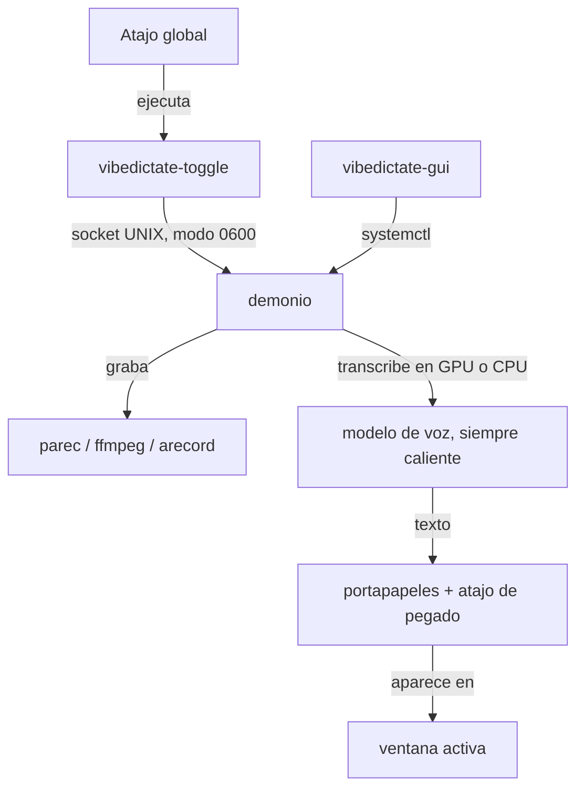

# 🎙️ VibeDictate

> **Dictado por voz rápido y totalmente local para Linux.**
> Pulsa un atajo, habla, y tus palabras aparecen en la ventana que tengas activa.
> Nada se sube a internet, nada queda registrado.

> 🌐 **Idioma:** [English](README.md) · [Español](README_ES.md)

> ⚠️ **Solo Linux.** Requiere sesión de usuario de systemd y PipeWire o PulseAudio.
> Probado en Arch/CachyOS, Debian/Ubuntu y Fedora, con Wayland y X11.
> No es compatible con Windows ni macOS.

---

## Qué hace

Un demonio mantiene el modelo de reconocimiento de voz cargado en la VRAM de la
GPU (o en la RAM). Al pulsar tu atajo empieza a grabar el micrófono; al pulsarlo
de nuevo transcribe en local e inyecta el texto en la ventana activa.

Como el modelo nunca se descarga de memoria, no hay coste de arranque por
dictado: solo el tiempo de la transcripción.

### Características

* **Totalmente sin conexión.** El audio se captura en `tmpfs`, se transcribe en
  local y el búfer se borra de inmediato. No hay llamadas de red después de la
  descarga inicial del modelo.
* **No deja rastro.** Las transcripciones nunca se escriben en el journal del
  sistema, y el portapapeles se restaura a su contenido anterior tras pegar.
* **Degradación automática de hardware.** Usa CUDA de NVIDIA cuando funciona y
  cae a CPU sin avisar cuando no, incluso si la GPU está presente pero sus
  librerías están rotas.
* **Wayland y X11.** El pegado por portapapeles conserva acentos, mayúsculas,
  `ñ` y emoji tal cual. Compatible con `wtype`, `ydotool` y `xdotool`.
* **Vocabulario personalizado.** Condiciona el reconocedor con jerga, nombres de
  producto o acrónimos para que deje de destrozar las palabras que sí usas.
* **Sin finales cortados.** El búfer de audio se vacía antes de parar, así que
  la última sílaba siempre entra.

### Rendimiento medido

10 segundos de habla, mejor de tres ejecuciones, en un portátil con RTX 5050
(8 GB) y CPU Zen 5 de 8 núcleos:

| Modelo | Backend | Tiempo para 10 s | Proporción |
|---|---|---|---|
| `large-v3-turbo` (por defecto) | CUDA · float16 | 0.70 s | 14× tiempo real |
| `large-v3-turbo` | CPU · int8 | 8.8 s | 1.1× tiempo real |
| `tiny` | CPU · int8 | 0.51 s | 20× tiempo real |

Una frase típica de cinco segundos se resuelve en aproximadamente un tercio de
segundo en GPU. El modelo se carga una vez al arrancar el servicio (1–5 s), no
en cada dictado.

El modelo grande solo es cómodo en GPU, por eso `install.sh` preconfigura uno
más pequeño en equipos sin tarjeta NVIDIA.

---

## Arquitectura



---

## Instalación

```bash
git clone https://github.com/KaliGASJ/VibeDictate.git
cd VibeDictate
./install.sh
```

El instalador:

1. Comprueba qué paquetes del sistema faltan y **te muestra el comando exacto**
   antes de ejecutar nada con `sudo`. No instala nada a tus espaldas.
2. Crea un entorno virtual en `~/.local/share/VibeDictate/.venv`.
3. Instala las librerías CUDA 12 / cuDNN 9 **solo si detecta una GPU NVIDIA**,
   de modo que no hace falta el toolkit CUDA del sistema. En los demás equipos
   preconfigura inferencia por CPU.
4. Instala un servicio de usuario de systemd y una entrada de escritorio.
5. Ejecuta una autocomprobación y te dice qué falta todavía.

Opciones útiles: `--yes`, `--prefix DIR`, `--skip-system-deps`, `--skip-cuda`.

Después, arráncalo:

```bash
systemctl --user start vibedictate.service
```

El modelo se descarga en el primer arranque (unos 1.5 GB el de por defecto) en
`~/.local/share/VibeDictate/models/`.

### Requisitos

Python 3.9 o superior, más:

| Para qué | Wayland | X11 |
|---|---|---|
| Grabar | `parec` (pipewire-pulse / pulseaudio-utils), o `ffmpeg`, o `arecord` | igual |
| Portapapeles | `wl-clipboard` | `xclip` o `xsel` |
| Pulsaciones | `wtype`, o `ydotool` en GNOME | `xdotool` |
| Notificaciones | `libnotify` (opcional) | igual |
| Panel de control | PyGObject + GTK4 o GTK3 (opcional) | igual |

`install.sh` traduce todo esto a los nombres de paquete correctos para pacman,
apt, dnf y zypper.

---

## Configurar el atajo de teclado

Vincula el comando `vibedictate-toggle` a la combinación que prefieras.
`Ctrl+Space` funciona bien.

* **KDE Plasma** — Preferencias → Atajos → Añadir → Orden: `vibedictate-toggle`
* **GNOME / COSMIC** — Configuración → Teclado → Atajos personalizados → Comando:
  `vibedictate-toggle`
* **Hyprland** — `bind = CTRL, SPACE, exec, vibedictate-toggle`
* **Sway** — `bindsym Ctrl+space exec vibedictate-toggle`

Si `~/.local/bin` no está en tu `PATH`, usa la ruta completa
`~/.local/share/VibeDictate/vibedictate-toggle`.

---

## GNOME con Wayland

El compositor de GNOME no implementa el protocolo de teclado virtual, así que
`wtype` no puede enviar el atajo de pegado ahí. Instala `ydotool`, que trabaja a
través del dispositivo `uinput` del kernel:

```bash
sudo pacman -S ydotool          # Arch / CachyOS
sudo apt install ydotool        # Debian / Ubuntu
sudo dnf install ydotool        # Fedora

sudo systemctl enable --now ydotoold
```

VibeDictate detecta GNOME y prefiere `ydotool` automáticamente. Si ninguna
herramienta funciona, el texto igualmente queda en tu portapapeles y una
notificación te avisa para que lo pegues a mano: el dictado nunca falla en
silencio.

---

## Configuración

Todos los ajustes viven en `~/.local/share/VibeDictate/env.sh`, un fichero de
shell normal. Aplica los cambios con
`systemctl --user restart vibedictate.service`.

| Variable | Por defecto | Qué hace |
|---|---|---|
| `VD_MODEL` | `deepdml/faster-whisper-large-v3-turbo-ct2` | Modelo a cargar. Usa `small` o `base` en equipos sin GPU. |
| `VD_DEVICE` | `auto` | `auto`, `cuda` o `cpu`. |
| `VD_COMPUTE` | `float16` | `float16`, `int8` o `float32`. |
| `VD_LANG` | `en` | Código de dos letras, o vacío para autodetectar. |
| `VD_PROMPT` | vacío | Vocabulario de condicionamiento, ~220 tokens máximo. |
| `VD_PASTE_METHOD` | `auto` | `auto`, `clipboard` o `type`. |
| `VD_PASTE_KEY` | `ctrl+shift+v` | Cambia a `ctrl+v` si dictas sobre suites ofimáticas. |
| `VD_CLIPBOARD_RESTORE` | `1` | Devuelve tu portapapeles anterior tras pegar. |
| `VD_LOG_TRANSCRIPT` | `0` | Escribe transcripciones en el journal. Solo para depurar. |
| `VD_AUDIO_DEVICE` | vacío | Fuente de entrada; ver `pactl list short sources`. |
| `VD_NOTIFICATIONS` | `1` | Burbujas de notificación del escritorio. |

`env.sh.example` documenta todas las opciones, incluidas las menos habituales.

### Vocabulario personalizado

`VD_PROMPT` sesga el reconocimiento hacia palabras que de otro modo saldrían
mal: términos técnicos, nombres de marca, nombres propios.

```bash
export VD_PROMPT="Kubernetes, Terraform, PostgreSQL, idempotente, Prometheus, Grafana"
```

---

## Privacidad

El sentido de ejecutar esto en local es que nada salga de la máquina, así que
los valores por defecto van en esa dirección:

* **El audio** se escribe en `$XDG_RUNTIME_DIR`, que es `tmpfs`: vive en RAM,
  nunca toca el disco, y el fichero se borra en cuanto se transcribe.
* **Las transcripciones no se registran.** El journal es persistente y legible
  por los administradores, así que ahí solo van longitudes y tiempos. Activa
  `VD_LOG_TRANSCRIPT=1` mientras depuras y vuelve a desactivarlo.
* **El portapapeles se restaura** a su contenido anterior tras pegar, para que
  los gestores de portapapeles no persistan tu dictado en disco. La restauración
  se omite si copiaste otra cosa mientras tanto.
* **El socket de control es modo 0600**, creado de forma atómica bajo un umask,
  así que en ningún momento queda accesible a otros usuarios de la máquina.
* **La red solo se usa una vez**, para descargar el modelo.

---

## Panel de control

```bash
vibedictate-gui
```

Muestra el estado en vivo (parado / arrancando / listo / grabando) y permite
detener el demonio para liberar VRAM cuando la necesites para otra cosa. También
aparece en el menú de aplicaciones como *VibeDictate*.

---

## Resolución de problemas

Empieza por aquí: informa de cada componente y de lo que falta.

```bash
~/.local/share/VibeDictate/vibedictate-daemon --check
journalctl --user -u vibedictate.service -n 50
```

| Síntoma | Causa y solución |
|---|---|
| El atajo no hace nada | ¿Está corriendo el servicio? `systemctl --user status vibedictate.service`. Luego comprueba que `vibedictate-toggle status` imprime `idle`. |
| Copia el texto pero no lo pega | No hay backend de pulsaciones. En GNOME instala `ydotool` (ver arriba); en el resto `wtype` o `xdotool`. |
| Usa CPU teniendo GPU NVIDIA | `--check` te dice si las librerías GPU están enlazadas. Reinstálalas con `.venv/bin/pip install -r requirements-cuda.txt`. |
| Se abre un diálogo de "pegado especial" | Pon `VD_PASTE_KEY="ctrl+v"`. |
| El demonio no arranca al iniciar sesión | Tu escritorio puede no alcanzar `graphical-session.target`. Ejecuta `systemctl --user add-wants default.target vibedictate.service`. |
| Se corta la última palabra | Sube `VD_TAIL_FLUSH` a `0.3`. |
| Sin VRAM suficiente | Usa un `VD_MODEL` más pequeño (`small`, `base`) o pon `VD_DEVICE=cpu`. |

---

## Desinstalar

```bash
./uninstall.sh
```

Elimina el servicio, los lanzadores, la entrada de escritorio y el directorio de
instalación. Pregunta antes de borrar los modelos descargados, y `--keep-models`
los conserva.

---

## Contribuir

Se agradecen reportes de errores y pull requests: ver
[CONTRIBUTING.md](CONTRIBUTING.md). Incluye la salida de
`vibedictate-daemon --check` en los reportes.

## Licencia

[MIT](LICENSE).
